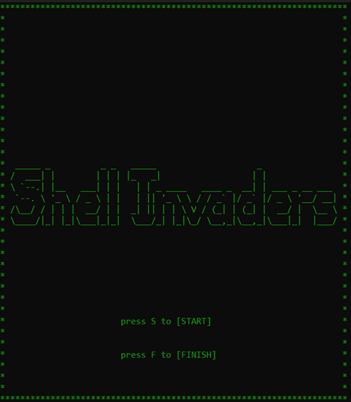
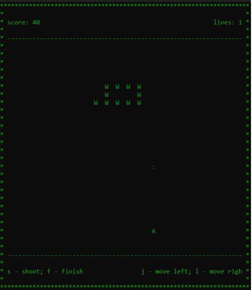
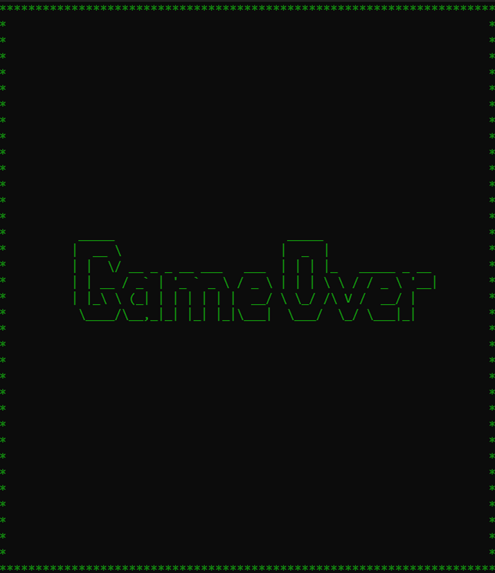

# 🐚 Shell Invaders

A **Bash-powered** remake of the classic *Space Invaders* — now playable **directly in your terminal**!  
This project blends retro arcade vibes with the simplicity of shell scripting.

---

## 📸 Screenshots

| Game Over | Menu | Gameplay |
|:--:|:--:|:--:|
|  |  |  |

---

## 🚀 Overview

**Shell Invaders** is a text-based *Space Invaders* clone written entirely in **Bash**.  
It’s a fun and educational project that explores real-time input, game loops, and terminal animation — all using shell scripting.

> I built this to level up my Bash scripting and workflow automation skills.

---

## 🎮 Gameplay

Move your ship, shoot down invaders, and survive as long as possible.  
The game runs entirely in the shell window — no extra dependencies, no GUI, just pure Bash.

### Controls

| Key | Action |
|-----|--------|
| `j` | Move left |
| `l` | Move right |
| `s` | Shoot |
| `f` | Finish (quit) |

---

## ⚙️ Setup

To simplify launching the game, use the provided `setup.sh` script.

### Options

| Option | Description |
|--------|--------------|
| `--alias` | Adds an alias in your `.bashrc` so you can run the game from anywhere |
| `--link` | Creates a system-wide soft link (requires **sudo**) |
| `--uninstall` | Removes the alias or link previously installed |
| `--help`, `-h` | Displays usage instructions |

### Example

```bash
# Clone the repository
git clone https://github.com/Daniil669/Shell_Invaders.git

# Navigate to the project directory
cd Shell_Invaders

# Install with alias (recommended)
bash setup.sh --alias

# OR install with sudo link
sudo bash setup.sh --link

# Uninstall when needed
bash setup.sh --uninstall
```

After installation, you can start the game from any directory using:
```bash
shellinvaders
```

---

## 🛠️ Tech Stack

- **Bash (>= 5.0)**  
- Compatible with **Linux** and **macOS**
- No support for Windows (use WSL)

---

